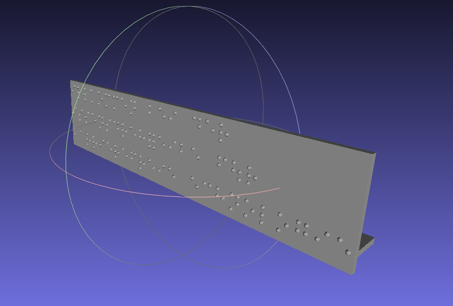

# 점자 플레이트 STL 생성기 (Braille Plate STL Generator)

한글, 영문, 숫자 텍스트를 입력하면 3D 프린터로 출력 가능한 **점자 플레이트 STL** 파일을 생성하는 Python GUI 앱입니다.



## 주요 기능

- **한글 · 영문 · 숫자** 입력 → 자동 점자 변환
  - 2017 한국 점자 규정 **단독 약자 11자** (가·나·다·마·바·사·자·카·타·파·하)
  - **VF 약자 13종** (억·언·얼·연·열·영·옥·온·옹·운·울·은·인) 자동 적용
- **Dome 점자** (기본) — 원기둥 앵커 + 반구 캡, FDM 프린터에서 탈락 없이 잘 붙는 기하
- **필렛된 백플레이트** — 윗면/옆 모서리는 라운드, 바닥면은 평면 유지 (프린터 배드 접착)
- **뒷면 음각 삼각형** — 설치자가 플레이트 위/아래 방향을 즉시 구별 (Boolean 차집합)
- **3가지 프리셋** (A 안정형 / B 박형 / C 사이니지) — 용도별 파라미터 일괄 설정
- **프린팅 지지대** 토글 (얇은 플레이트가 프린팅 중 휘지 않도록)
- **Tkinter GUI** + Unicode 점자 (U+2800 ~ U+28FF) 실시간 미리보기
- **trimesh 3D 뷰어** 로 저장 전 STL 미리보기 (별도 프로세스, GUI 안 멈춤)
- **바이너리 STL** 출력 (numpy-stl)

## 설치

Python 3.10+ 권장.

```bash
pip install -r requirements.txt
```

`requirements.txt` 내용:
- `numpy`, `numpy-stl` — 메시 연산 & STL 직렬화
- `trimesh[easy]` + `pyglet<2` — 3D 미리보기 뷰어
  - (trimesh 4.x 내장 뷰어가 아직 pyglet 2.x 미지원이라 1.5 계열로 핀)
- `manifold3d` — 뒷면 음각 삼각형을 위한 Boolean 차집합 연산

## 실행

```bash
python3 app.py
```

1. 텍스트 입력란에 원하는 문구 입력 (Enter 로 줄바꿈)
2. **프리셋 A/B/C** 버튼으로 용도별 파라미터 원클릭 적용 (또는 직접 조정: 두께 · 필렛 · 점 반경 · 음각 등)
3. **3D 미리보기** 로 모양 확인 → **STL 파일로 저장**

---

## 개발 배경

이 프로젝트는 [**benjaminaigner/braillegenerator**](https://github.com/benjaminaigner/braillegenerator) 의 `braille.jscad` (OpenJSCAD) 파일을 참조하여 **한글 점자 지원을 추가**하고 **Python + Tkinter GUI 로 포팅**한 파생 저작물입니다.

### 원본에서 계승한 것

- 점자 셀의 기하 상수 (점 지름 1.44 mm, 셀 내 점 간격 2.5 mm, 문자 간격 6 mm, 줄 간격 10.8 mm, 플레이트 두께 2 mm)
- 2 mm 백플레이트 + 인쇄 지지대 구조
- 문자 → 점자 비트맵 매핑의 기본 아이디어

### 새로 구현한 것

#### 1. 한국어 점자 (국립국어원 2017 한국 점자 규정)

`braille_data.py`:

- **초성 19자** (`ㄱ~ㅎ`, 쌍자음 포함) — 쌍자음은 `ㅅ`(dot 6) 프리픽스 + 평자음 2셀
- **중성 21자** — `ㅘ`, `ㅙ`, `ㅝ`, `ㅞ`, `ㅟ`, `ㅢ`, `ㅒ` 등 복모음은 2셀
- **종성 28자** — 겹받침 (`ㄺ`, `ㄻ`, `ㄼ`, `ㄽ`, `ㄾ`, `ㄿ`, `ㅀ`, `ㅄ`, `ㄳ`, `ㄵ`, `ㄶ`) 모두 2셀 분해
- Hangul Syllables (U+AC00 ~ U+D7A3) 자동 **초성+중성+종성** 분해
- `ㅇ` 초성 생략 규칙 적용
- **단독 약자 11자** (제29항) — 자음+ㅏ(받침X) 음절을 단일 셀로. 카 → ⠋, 가 → ⠫, 사 → ⠇ 등
- **VF 약자 13종** (제29항) — (모음, 종성) 조합 단일 셀 축약. 예: 신(ㅅ+ㅣ+ㄴ) → ⠠⠟ (ㅅ초성 + 인약자), 분(ㅂ+ㅜ+ㄴ) → ⠘⠛ (ㅂ초성 + 운약자)

검증 레퍼런스: [t.hi098123.com/braille](https://t.hi098123.com/braille) 의 변환 결과와 일치 (신분증 → ⠠⠟⠘⠛⠨⠪⠶, 카드입구 → ⠋⠊⠪⠕⠃⠈⠍)

#### 2. 영문 / 숫자

- Grade-1 영문 점자 (a-z)
- 숫자 prefix `⠼` (dots 3-4-5-6) + letter sign `⠰` (dots 5-6) 전환
- 대문자 prefix `⠠` (dot 6)
- 기본 문장부호 (`. , ? ! ; : ' - ( ) "`)

#### 3. Python 메시 파이프라인 (`generator.py`)

- 순수 `numpy` 로 UV sphere · Dome(원기둥+반구) · axis-aligned box · 필렛 플레이트 메시 생성 (모두 watertight, 외향 normal)
- 점자 ↔ 플레이트 결합: **오버랩 union** (슬라이서 자동 병합)
- 뒷면 음각: **`trimesh + manifold3d` Boolean 차집합** — 필렛된 라운드 뒷면에서도 깨끗하게 파냄
- `numpy-stl` 로 바이너리 STL 직렬화

#### 4. 필렛 백플레이트 (사용자 요청으로 추가)

3D 프린팅에 친화적인 "위·옆은 둥글게, 바닥은 평면" 플레이트:

- **스켈레톤 사각형** `[r, W-r] × [r, H-r]` 을 기준으로 높이별 오프셋
- 수직 영역 `z ∈ [-t, -r]`: 외측 오프셋 `d = r` 고정 → **수직 모서리 4개** 라운드
- 상단 필렛 `z ∈ [-r, 0]`: `d(z) = √(r² - (z+r)²)` 로 수축 → **윗면 모서리 4개** 1/4 원호
- 바닥면 `z = -t`: 라운드 사각형이지만 **측벽과는 90° 샤프** 유지 → 프린터 배드 접착면 보장
- `r` 자동 클램프: `min(r, W/2, H/2, t) − eps`
- 링 기반 스윕 + 팬 트라이앵글레이션 → `trimesh.is_watertight == True` 보장

#### 5. Tkinter GUI (`app.py`)

- 텍스트 입력 + 옵션 위젯 (백플레이트, 지지대, 두께, 필렛 반경, 점 스타일/반경/박힘, 음각 ON·변·깊이)
- **프리셋 A/B/C 버튼** — 클릭 한 번으로 플레이트·필렛·점·음각 일괄 세팅
- 입력 즉시 Unicode 점자 미리보기 갱신
- 플레이트 최종 치수 실시간 표시

#### 6. 3D 뷰어 (`preview_stl.py`)

- **서브프로세스**로 실행 → Tkinter 메인 루프 블로킹 없음 (특히 macOS)
- `trimesh.Scene.show()` + pyglet 뷰어
- 임시 STL 파일 생성 → 프로세스에 경로 전달 → 앱 종료 시 `atexit` 로 정리

#### 7. Dome 점자 (탈락 방지 + 평평 꼭대기)

실제 3D 프린트에서 **구(sphere) 점자가 탈락**하는 문제를 겪고, **Dome** (원기둥 앵커 + 반구 캡) 기하로 기본값을 전환했습니다.

- 원기둥이 플레이트 안으로 `embed_depth` (기본 0.15 mm) 박혀 **앵커** 역할 → 층간 seam 분산
- 반구 캡의 반경 = 가시 높이 (ADA 점자 가이드 0.6 ~ 0.9 mm)
- 접촉 면적 π × r² ≈ **2.0 mm²** (구 접선 접촉 대비 +23%)
- **꼭대기 평평 깎기** (`flat_top_depth`, 기본 0.05 mm, on/off 토글) — 반구 꼭지를 살짝 절단해 FDM 노즐이 '점'이 아닌 **작은 면 (지름 ≈ 0.6 mm)** 에서 종료하도록 하여 뾰족 꼬리/블롭 제거
  - 기하 수식: 평면 캡 반경 = √(2 R d − d²), R = 점 반경, d = 깎기 깊이
  - GUI 체크박스로 언제든 OFF 가능 (레거시 뾰족 꼭지)
- 레거시 `sphere` 스타일도 옵션으로 유지

부수적으로 기존 `uv_sphere` 의 winding 버그 (삼각형이 안쪽을 향함, volume 음수) 도 함께 수정.

#### 8. 프리셋

용도별로 **플레이트 · 필렛 · Dot · 음각** 파라미터를 일괄 설정:

| 프리셋 | 용도 | 두께 | 필렛 | 점 반경 | 점 박힘 | 음각 (변 × 깊이) |
|---|---|---|---|---|---|---|
| **A 안정형** | 일반 사용 | 2.0 mm | 1.5 mm | 0.8 mm | 0.15 mm | 8.0 × 0.5 mm |
| **B 박형** | 벽·면 부착 | 1.2 mm | 0.6 mm | 0.75 mm | 0.20 mm | 6.0 × 0.3 mm |
| **C 사이니지** | 공공 표지 | 2.5 mm | 2.0 mm | 1.0 mm | 0.20 mm | 10.0 × 0.7 mm |

#### 9. Y축 미러 (3D 뷰어 · 프린터 호환)

내부 좌표계는 편집 편의상 Y가 아래로 증가(line 0 상단, line N 하단) 하지만, STL 출력 시 **Y-up 뷰어 및 3D 프린터 축 관습** 에 맞게 점자 배치를 Y축 기준으로 거울 반전:

- 라인 순서: `effective_line = (num_lines - 1) - line_idx`
- 셀 내 점 위치: `dy_flipped = 2 × DOT_SPACING - dy`
- 플레이트는 Y 대칭이라 영향 없음, 지지대도 `y = plate_h` 에 고정

결과: 뷰어에서 회전·줌해도 점자가 정상 순서로 읽히고, 프린트 후 손에 쥐어도 입력 텍스트 순서가 유지됨.

#### 10. 뒷면 음각 삼각형 (설치 방향 표시)

시각장애인 사용자가 아닌 **플레이트를 부착하는 사람** 을 위한 기능 — 플레이트 뒷면에 작은 음각 삼각형을 새겨 "이쪽이 위" 를 즉시 구별:

- 위치: 뒷면 중앙 `(plate_w/2, plate_h/2)` 에 정삼각형
- 방향: apex 가 **+Y 방향** (설치자가 뒷면을 볼 때 "위쪽")
- 구현: watertight 정삼각형 prism 을 `trimesh.boolean.difference` 로 플레이트에서 차집합 → 필렛된 라운드 뒷면도 깨끗하게 파냄
- 자동 클램프: `size ≤ min(W · 0.4, H · 0.6)`, `depth ≤ thickness · 0.4`
- 점자를 읽는 데는 전혀 영향 없음 (반대면)

---

## 아키텍처

```
app.py                    Tkinter GUI (엔트리 포인트)
 ├── braille_data.py       점자 매핑, Hangul 분해, 텍스트 → 셀
 ├── generator.py          셀 → 3D 메시 → STL 파일
 │     └── numpy-stl
 └── preview_stl.py        trimesh + pyglet 뷰어 (subprocess)
```

## 지오메트리 상수

| 항목 | 기본값 | 출처 |
|---|---|---|
| Dome 점 반경 (= 가시 높이, 기저=2r) | 1.0 mm | 실사용 튜닝 (ADA 상한) |
| Dome 점 플레이트 박힘 | 0.15 mm | 새로 추가 (앵커) |
| Dome 꼭대기 평평 깎기 | 0.05 mm | 새로 추가 (FDM 노즐 안착) |
| 셀 내 점 간격 | 2.5 mm | `braille.jscad` |
| 문자 간격 | 6.0 mm | `braille.jscad` |
| 줄 간격 | 10.8 mm | `braille.jscad` |
| 플레이트 두께 | 1.5 mm | 실사용 튜닝 (원본 2.0) |
| 플레이트 여백 | 2.0 mm | 새로 추가 |
| 필렛 반경 | 1.5 mm | 새로 추가 (프리셋 A) |
| 음각 삼각형 변 | 4.0 mm | 새로 추가 |
| 음각 깊이 | 0.2 mm | 새로 추가 |
| UV sphere / Dome 해상도 | lat 6 × lon 10 / lat 4 × lon 10 | 새로 추가 |
| 레거시 sphere 직경 | 1.44 mm | `braille.jscad` |

## 파일 구조

```
.
├── app.py             # Tkinter GUI
├── braille_data.py    # 점자 매핑 + Hangul 분해
├── generator.py       # 메시 생성 + STL 저장
├── preview_stl.py     # trimesh 뷰어 (subprocess)
├── requirements.txt
├── braille.jscad      # 원본 OpenJSCAD 스크립트 (참조용)
├── braille1.png       # 원본 데모 이미지
├── LICENSE            # GPL-3.0 전문
└── README.md
```

---

## 라이선스 & Attribution

본 프로젝트는 **GPL-3.0-or-later** 로 배포됩니다. 상세는 [LICENSE](LICENSE) 참조.

### 원저작물 (Upstream)

본 프로젝트는 다음 저작물의 **파생 저작물 (derivative work)** 입니다:

| 항목 | 정보 |
|---|---|
| 원본 프로젝트 | [benjaminaigner/braillegenerator](https://github.com/benjaminaigner/braillegenerator) |
| 원저작자 | Benjamin Aigner |
| 원본 라이선스 | GPL-3.0 |
| 참조한 파일 | `braille.jscad`, `braille1.png` |

원본은 `braille.jscad` 만 존재하는 OpenJSCAD 스크립트였으며, 본 포트에서는:
- 독일어 점자 대신 **한글 (2017 점자 규정 약자 포함) · 영문 · 숫자** 매핑 사용
- OpenJSCAD 대신 **순수 Python + numpy-stl** 파이프라인 (+ 음각은 `trimesh + manifold3d`)
- **GUI · 3D 미리보기 · 필렛 플레이트 · Dome 점자 · 프리셋 · Y 미러 · 뒷면 음각 삼각형** 추가

GPL-3.0 의 copyleft 조항에 따라 본 파생 저작물도 동일하게 GPL-3.0 으로 배포됩니다. 소스 수정/재배포는 자유이며, 재배포 시 동일 라이선스 유지와 소스 공개 의무가 있습니다.

### Python 파일 저작권 표기

각 `.py` 파일 상단에 SPDX 식별자와 copyright notice 를 포함합니다:

```python
# SPDX-License-Identifier: GPL-3.0-or-later
# Copyright (C) 2026 zobithecat
# Derivative of https://github.com/benjaminaigner/braillegenerator
#   Copyright (C) Benjamin Aigner (GPL-3.0)
```
